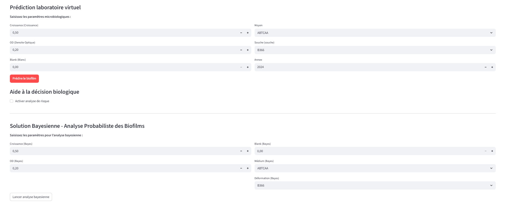

\# Biofilm Prediction Using Machine Learning


\## 📌 Project Overview


This project focuses on the analysis of microbiological data and the prediction of pathogenic biofilm formation in food environments using statistical analysis and machine learning techniques.


The objective is to develop an intelligent solution capable of analyzing microbiological measurements and predicting the level of biofilm formation.


\## 🎯 Objectives


\* Analyze microbiological data related to biofilm formation.

\* Perform exploratory data analysis (EDA).

\* Preprocess and clean the dataset.

\* Identify important factors associated with biofilm formation.

\* Develop machine learning models for prediction.

\* Evaluate model performance using appropriate metrics.

\* Provide an interactive Streamlit dashboard for prediction and visualization.


\## 🧠 Methodology


The project follows a data science and machine learning pipeline:


1\. Data collection

2\. Data cleaning and preprocessing

3\. Exploratory Data Analysis

4\. Feature engineering

5\. Model training

6\. Model evaluation

7\. Prediction

8\. Interactive dashboard deployment


\## 🤖 Machine Learning


Several machine learning techniques were explored for the prediction task, including:


\* K-Nearest Neighbors (KNN)

\* Random Forest

\* Classification techniques

\* Regression techniques

\* Model evaluation and interpretation


The project also uses SHAP-based model interpretability to better understand the contribution of the different features to the predictions.


\## 📊 Technologies Used


\* Python

\* Pandas

\* NumPy

\* Scikit-learn

\* Matplotlib

\* Seaborn

\* Plotly

\* SHAP

\* Streamlit

\* Joblib


\## 🖥️ Interactive Dashboard


The project includes an interactive Streamlit application that allows users to:


\* Explore the dataset

\* Visualize microbiological information

\* Enter prediction parameters

\* Obtain model predictions

\* Analyze prediction results


\## 📁 Project Structure


```text

biofilm-project/

│

├── new2.py

├── requirements.txt

├── README.md

└── model\_biofilm.pkl

```


\## ⚙️ Installation


Clone the repository and install the required Python libraries:


```bash

pip install -r requirements.txt

```


\## ▶️ Run the Application


Start the Streamlit application with:


```bash

python -m streamlit run new2.py

```


The application will then be available locally through the Streamlit URL displayed in the terminal.


\## 🔬 Project Context


This project was developed as part of a final-year academic project in Applied Mathematics and Statistics, with a focus on data analysis, statistical modeling, artificial intelligence, and microbiological risk prediction.


\## 👩‍💻 Author


\*\*Mira Bdioui\*\*


Applied Mathematics \& Statistics

Data Science | Machine Learning | Artificial Intelligence
## 🖥️ Dashboard Preview



\## 📄 License


This project is intended for academic and educational purposes.


